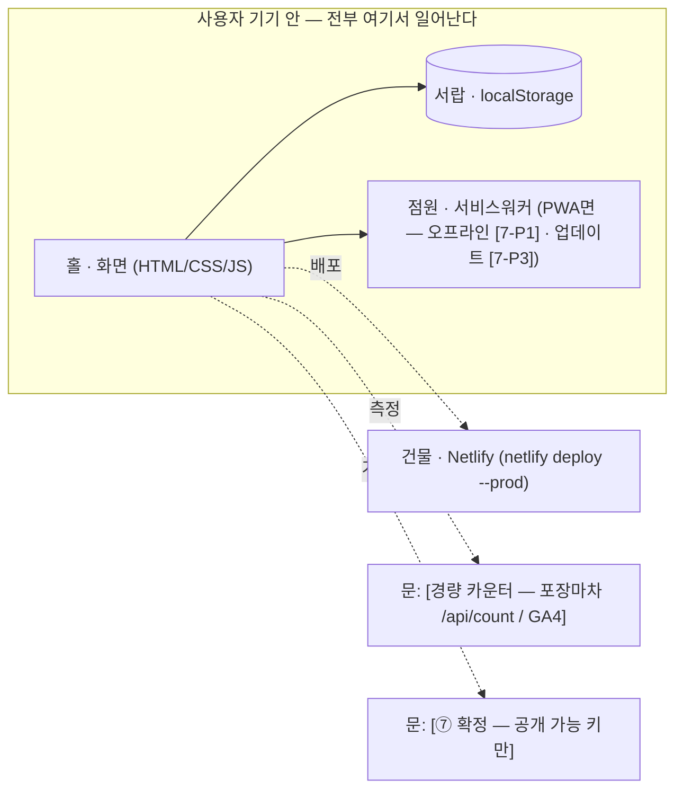

# blueprint 개편 설계 — 트랙 분기·출시 준비·스피드런 (P1-4)

> 위치: `docs/설계-blueprint-개편.md` · 작성일: 2026-07-30 · 상태: 검증 통과 (설계안 3건 심사·병합 → 적대 검증 조건부 통과 → 지적 7건 반영. **회장님 확정 시 파일 반영 시작**)
> 관점: **기존 체계 호환 우선, 감축은 공격적으로.** 산출물 7종+screens/+plan.md 2층 조립·부분 발동·허점 라운드·인터뷰 규칙 10개는 전부 유지한다. 바꾸는 건 "어느 질문을 누구에게 안 묻느냐"와 "만든 뒤 여는 법"이다.
> 수정 대상 파일 5개: `SKILL.md` · `references/question-bank.md` · `references/templates.md` · `profile.md` · `.env.example` (전부 `C:/dev/vibe-kit/` 기준). 훅·plan.md 템플릿·screens 골격·다른 스킬은 불변.
> 이 문서가 확정되기 전에는 blueprint 파일을 만지지 않는다.

---

## 0. 설계 원칙 — 무엇을 안 바꾸나

식당 비유로: 주방을 새로 짓는 게 아니라 **메뉴판에 "포장 전용 코스"를 하나 추가하는 것**이다. 홀·주방·계산대(산출물 체계·훅·규칙)는 그대로 두고, 손님(프로젝트)에 따라 안 나가는 접시를 정한다.

| 유지 (불변) | 근거 |
|---|---|
| 8단계 틀과 단계 순서 | 사용자에게 각인된 브랜드("8단계 질문")이고 "지금 N/8단계" 진행 표기가 SKILL.md 전반에 걸려 있다. 9단계로 늘리지 않는다 — 출시는 ⑧ 후반부로 흡수 (§1에 기각 근거) |
| 산출물 파일명 7종 + screens/ + plan.md | 부분 발동("DB 설계 도와줘"→05-db.md)·훅·기존 프로젝트 참조가 파일명에 걸려 있다. 정적 트랙도 **같은 파일명에 다른 골격**을 쓴다 |
| 인터뷰 규칙 10개 · 허점 라운드(최대 5문) · 부분 발동 절차 | 변경 근거 없음. 괄호구·후보 목록 추가만 (§6) |
| question-bank 원 문항 | **삭제 0건.** 정적 트랙에서 안 묻는 문항은 조건 태그(`(풀스택 트랙만)` 등)를 다는 방식 — 6단계 카드 흐름이 원 문항을 "재료"로 보존한 것과 같은 수법. 이래야 부분 발동·기존 프로젝트가 안 깨진다 |
| plan-gate 훅 | plan.md 채움 여부와 apps/ 경로만 본다 — 이번 개편과 접점 없음 (§9 리스크 참조) |
| 조립 블럭 4종(공간·역할·창고·문) | 유지. 정적 트랙에서 창고의 뜻만 바뀐다(서버 창고 → 브라우저 서랍) — 주석 1줄 |

**새로 생기는 것**: ⓐ 3단계 끝 트랙 판정 1회(3-7 — 기존 요약 카드에 병합, 카드 +0) ⓑ 7단계 PWA 블록(7-P)·8단계 출시 준비 카드(8-L)와 `launch-checklist.md` ⓒ 스피드런 모드(profile.md 고정 기본값 기반, 라이트=스피드런 통합) ⓓ 05-db/07-architecture 정적 트랙 골격 ⓔ ⑤ 예외 스윕 묶음 확인(트랙 공통 감축).

**바꾸는 것 1건과 근거 (제약: 기존 체계 변경 시 근거 명시)** — 5-7 예외 5종 스윕을 "화면당 카드 1장"에서 "묶음 확인(최대 4화면/카드, 경합 화면만 개별)"으로 바꾼다. 근거: 스윕은 추천 처리안 1순위의 확인형이라 대부분 "맞아"로 통과한다 — 6단계 카드 ①의 "자명한 건 묶고 경합만 개별" 원칙을 그대로 적용하는 것이며, 전 화면 표를 먼저 보여주므로 정보 손실이 없다. 화면 5개 기준 카드 5장 → 1~2장.

**질문 총량 원칙**: 풀스택 트랙 = 현행 대비 **순감 −3 내외**(신설 8-L +1을 8단계 병합 −1과 스윕 묶음 −2~−3으로 상쇄하고 남는다), 정적 트랙 = **−15 내외**. 상세는 §8.

---

## 1. 단계 구조 — 8단계 유지, 갈림길 하나와 마무리 하나

```
① 아이디어 한 줄
② 타겟·문제
③ 핵심 기능·스코프컷 ──▶ [3-7 트랙 판정 1회] ← 신설 (3단계 요약 확인 카드에 병합 — 카드 +0)
                              │
              ┌───────────────┴───────────────┐
        정적 트랙                          풀스택 트랙
   (브라우저 저장 + Netlify)          (Supabase + Vercel — 현행 그대로)
              │                               │
④ 유저플로우 (로그인·결제 문항 미발동)   ④ 유저플로우 (현행)
⑤ 화면 (관리자 문항 미발동·스윕 묶음)   ⑤ 화면 (현행 + 스윕 묶음)
⑥ 데이터 — 로컬 축약판                 ⑥ 데이터 — 현행 카드 ①~⑤
⑦ 연동 — Netlify 기본·문 최소          ⑦ 연동 — Supabase·Vercel 자동 포함(현행)
   + 7-P PWA 4문 (기본 제안)              + 7-P PWA (조건부 제안)
⑧ 지킬 조건·출시 준비 (축약)            ⑧ 지킬 조건·출시 준비 (병합 축약)
   + 8-L 출시 준비 카드 (양 트랙 공통: 측정·첫 채널·수익 사다리·OG)
              └───────────────┬───────────────┘
                    9. 산출물 (+launch-checklist.md, +AGENTS.md 갱신 1줄)
                    9.5 허점 라운드 → 10. 빌드 연결
```

**9단계 신설 기각 근거 (심사에서 나온 대안)**: "지킬 조건은 빌드 전에 정하는 규칙, 출시는 빌드 후에 하는 행동이라 시점이 다르다"는 논거는 유효하다. 그러나 그 구분은 `launch-checklist.md`라는 **독립 산출물**이 담보하고, 단계를 늘리면 "지금 N/8단계" 표기·§0 지도·부분 발동 문구·사용자 습관까지 파급이 크다. 8단계 이름을 "지킬 조건·출시 준비"로 확장하는 쪽이 비용이 압도적으로 작다.

### 1-1. 트랙 분기 위치와 이유

**3단계(핵심기능·스코프컷) 직후, 딱 1회.** 이유: ①~③이 끝나야 "데이터가 어디 살아야 하는지"를 판정할 재료(기능 목록·감당선 판정표)가 모인다. 4단계 이후로 미루면 유저플로우·화면·데이터 질문이 트랙을 몰라서 이중으로 갈라진다. 판정 카드는 **3단계 요약 확인 카드(규칙 4)에 병합**해 카드 수를 늘리지 않는다.

### 1-2. 판정 질문 문안 (question-bank 3단계 끝에 신설: **3-7**)

**3-7. 트랙 판정 (3단계 요약 확인 카드에 병합 — AI가 신호표를 먼저 보여주고 카드로 확정)**

묻기 전에 AI가 1~3단계 답에서 아래 신호표를 채워 보여준다:

| 신호 (하나라도 '예'면 서버가 필요하다) | 이 프로젝트 | 근거 (몇 단계 답) |
|---|---|---|
| 로그인이 있거나, 사용자마다 다른 데이터를 보나 | 예/아니오 | |
| 여러 사람이 같은 데이터를 봐야 하나 (공유·랭킹·게시판·예약 현황) | | |
| 결제를 받나 (후원 링크는 제외 — 그건 8-L 수익 사다리에서) | | |
| 숨겨야 할 키가 있나 (AI 호출·결제 비밀키 — 서버에서만 지킬 수 있다) | | |
| 사람이 안 눌러도 시간 맞춰 도는 일이 있나 (매일 집계·N일 뒤 발송) | | |
| 관리자가 남의 데이터를 넣고 고치나 | | |

카드 질문 문안: **"이 앱의 데이터, 어디에 살면 됩니까?"**
- **정적 트랙 (추천 — 신호 6종 전부 '아니오')**: 데이터가 쓰는 사람 **본인 기기(브라우저)** 에만 있으면 된다. 서버 없이 브라우저 저장(localStorage) + 정적 배포(Netlify). 공짜·즉시 배포·관리할 서버 0. 대신 기기를 바꾸면 데이터가 안 따라온다 — 6단계에서 대비책(내보내기)을 정한다.
- **풀스택 트랙 (추천 — 신호 [걸린 항목])**: [걸린 신호] 때문에 서버 창고가 필요하다 — Supabase(창고·경비실) + Vercel(건물). 현행 인터뷰 그대로 간다.
- **잘 모르겠다** — 신호를 하나씩 다시 보자 (AI가 신호별로 되묻는다).

비유(카드 설명): 정적 = 손님마다 수첩을 나눠주는 가게(수첩은 손님 주머니에 있고, 가게는 종이만 찍는다). 풀스택 = 장부를 카운터에 두는 가게(누가 와도 같은 장부를 본다).

- 왜 묻나: 트랙이 4~8단계 질문의 절반을 정한다. 정적이면 로그인·결제·권한·RLS 질문이 통째로 사라지고, 배포는 Netlify CLI 한 줄이 된다. 잘못 고르면 서버 없는 앱에 서버 설계를 하는 낭비 또는 그 반대가 난다.
- **"나중에 로그인 붙일 수도" 처리**: 정적으로 시작 + 로드맵(3-4)에 **승격 층** 표시. 06-decisions.md에 4줄 기록(승격 비용: localStorage → Supabase 이전, 내보내기 JSON이 이전 재료).
- **재판정 규칙 (최대 1회)**: 이후 단계에서 반대 신호가 나오면(정적인데 로그인·결제·공유·숨길 키·서버 자동화가 튀어나옴) 그 자리에서 이 카드로 돌아와 재판정한다. "그 기능을 다음 버전으로 미루고 정적 유지"도 정답이다(로드맵 층으로 보존 — 3-4 정합). 무한 흔들림 방지를 위해 재판정은 1회. 판정·재판정은 06-decisions.md에 4줄로 기록한다.
- 트랙 기록 3곳: plan.md 헤더 1줄(`트랙: 정적/풀스택`) · 01-prd §7 기본 스택 줄 · 06-decisions.md 4줄.
- 예시 답: "운동 기록은 내 폰에만 있으면 돼요. 공유는 다음 버전." → 정적 트랙, 공유는 로드맵 다음 버전 칸.

---

## 2. 트랙별 질문 흐름 — question-bank.md 수정 지시

> 원칙: **기존 문항은 삭제하지 않는다.** 정적 트랙에서 안 묻는 문항은 조건 태그(`(풀스택 트랙만)` / `(정적 트랙: ~로 대체)`)를 단다. 트랙 태그는 조건부 질문(규칙 3)과 같은 취급이다.

### 1~2단계 — 공통 (수정 없음, 태그 2건)
- **2-6 (규모)**: 문항 유지. 끝에 1줄 추가 — "이 답은 3-7 트랙 판정과 7-9 규모 판정의 재료가 된다."
- **2-8 (민감정보 판정)**: 유지. 끝에 1줄 추가 — "정적 트랙으로 판정되면 6단계에서 '기기 안 저장' 문맥으로 이어받는다(서버 유출면은 없지만 공용 PC·데이터 실린 공유 URL 주의)."

### 3단계 — 3-7 신설 (§1-2 문안 전문), 그 외 수정 없음
- 3-1 감당선 판정표 유지. 판정표 아래 1줄 추가: "판정이 끝나면 3-7 트랙 판정의 신호표 재료가 된다."

### 4단계 — 정적 트랙 태그 3건 + 주석 1건
| 문항 | 수정 지시 |
|---|---|
| 4-3 (로그인 위치) | 조건 태그: **(풀스택 트랙만)** — 정적 트랙은 "로그인 없음"을 자동 기록하고 묻지 않는다. 사용자가 로그인을 꺼내면 3-7 재판정 |
| 4-7 (운영자 흐름) | 유지 + 정적 주석 1줄: "정적 트랙은 서버에 쌓이는 데이터가 없다 — 운영자 흐름은 대부분 '코드 수정 후 재배포'다. 확인형 1문항(추천 1순위: 운영자 흐름 없음)으로 축약하고, 관리자 화면 요구가 나오면 3-7 재판정" |
| 4-C1 (결제 흐름) | 조건에 추가: **(풀스택 트랙만)** — 정적에서 결제가 나오면 3-7 재판정 |
| 4-C3 (화면 밖 알림) | 조건에 추가: **(정적 트랙이면)** 문구 교체 — "페이지가 열려 있을 때 울리는 로컬 알림(타이머·리마인드)이 필요한가"로 축약. 사이트를 닫은 뒤 알림은 서버가 필요하다 — 재판정 또는 다음 버전 안내 |

### 5단계 — 스윕 묶음(공통) + 정적 태그 2건 + PWA 연결 1줄
| 문항 | 수정 지시 |
|---|---|
| 5-0 (공간 나누기) | 유지 + 정적 주석 1줄: "정적 트랙은 대부분 공간 1개(손님용 웹)다 — 관리자 공간이 필요하다는 답이 나오면 3-7 재판정" |
| 5-6 (기기 우선) | 유지 + 끝에 1줄: "모바일 우선 + 재방문 도구 성격이면 7-P(PWA)에서 설치형 여부를 묻는다 — 설치 유도 배너는 화면 요소이므로 '예'면 5단계 화면 목록에 반영한다" |
| **5-7 (예외 5종 스윕)** | **트랙 공통 변경**: "화면당 카드 1장" 문구를 "전 화면 표를 한 번에 보여주고, **카드 1장에 최대 4화면 묶어 확인** — 경합 화면(입력 많음·갈림길 많음)만 개별 카드"로 교체. 근거 병기(§0). 정적 트랙은 예외 5종의 "권한 없음·비로그인" 칸을 "해당 없음" 자동 기입 |
| 5-C4 (관리자 화면) | 조건에 추가: **(풀스택 트랙만)** |
- 5-C3(로그인별 화면)은 수정 불필요 — 조건(로그인 있음) 자체가 정적에서 성립하지 않는다.

### 6단계 — 정적 트랙 축약판 신설: "6단계-정적 카드 흐름"
기존 "6단계 카드 흐름 (강제)" 헤더 아래에 분기 문단을 추가하고, 정적 전용 흐름을 신설한다. **풀스택은 현행 카드 ①~⑤+보조 그대로.**

> **정적 트랙이면 아래 축약 흐름으로 간다.** 창고가 서버가 아니라 **사용자 브라우저 안(localStorage)** 이다 — 서랍 비유: 공용 창고가 아니라 각자 책상 서랍. 남과 못 나누고, 책상(기기)을 바꾸면 서랍도 새것이다. 이 한계를 사용자가 알고 설계하게 하는 것이 이 축약판의 목적이다. 원 문항의 "왜 묻나"는 그대로 승계한다.

| 카드 | 내용 | 현행 대비 |
|---|---|---|
| 카드 ① 개체 전수조사 | **현행과 동일** (명사 전수 추출 → 판정표 → 자명 묶음/경합 개별 확정 — 판정 없이 지나가는 명사 0) | 유지 (6-1 승계) |
| 카드 ② 개체별 필드 | 현행과 동일 — 종류(글자/숫자/날짜/예아니오)·필수 병기도 유지(JSON에서도 날짜를 글자로 넣으면 정렬이 깨지는 건 똑같다). 단 **"소유자" 문항 삭제** (전부 본인 기기 것 — 물을 게 없다) | 축약 (6-2~6-4 승계, 6-5 자동) |
| 카드 ③-L 구조 판정 | 관계 쌍 전수 순회 **대신**, AI가 "중첩(부모 객체 안 배열) vs 참조(id 연결)" 판정표를 만들어 **1카드로 확인**(경합 쌍만 개별 문항). 추천 기본 = 중첩(로컬 JSON은 중첩이 자연스럽다 — 운동 기록 안에 세트 배열). 참조는 양쪽에서 독립 조회·수정될 때만. N:M이 나오면 경고(정적에서 드물다 — 구조 재검토 또는 풀스택 신호). 근거: localStorage엔 조인이 없다 — 관계 질문의 목적(빌드 중 발견되는 관계 방지)은 구조 확인으로 동일하게 달성되고, 이건 생략이 아니라 규칙 10의 확인형 전환이다 | 카드 ③ 대체 (6-6·6-7 승계) |
| 카드 ④ 권한 | **없음** — 05-db 정적 골격에 "데이터가 본인 기기에만 있다, 서버 권한(RLS) 없음"을 자동 기록. "생략"이 아니라 "해당 없음"이다 — 규칙 7은 데이터 구조·보존에 대한 것이고, 존재하지 않는 방의 출입 규칙은 물을 수 없다 | 삭제 (6-9·6-10 자동 기록) |
| 카드 ⑤-L 데이터 생존 규칙 (1카드 4문항 — **필수, 생략 불가**) | ⓐ **삭제 방식** [진짜 삭제 / 휴지통(deleted 표시) — 로컬에서도 실수 복구 가치가 있다] ⓑ **용량 환산 고지** — AI가 필드×예상 규모로 계산해 확인받는다: "하루 N건이면 **localStorage 5MB 한계**로 약 M년치 — 괜찮습니까?" 합계가 절반(2.5MB)을 넘으면 정리 정책(오래된 것 자동 정리 / 사용자 알림) 확정. 이미지 저장 욕구가 보이면 경고 — **base64 한 장이 수 MB, localStorage 금지**(필요하면 IndexedDB 또는 3-7 재판정) ⓒ **기기 소실 고지** — "브라우저 데이터 삭제·기기 변경이면 기록이 다 사라진다"를 사용자에게 **화면 어디에·어떤 문구로** 알릴지 확정(예: 설정 화면 "이 기록은 이 기기에만 저장됩니다"). 안 알리면 데이터 날린 사용자의 원망은 앱이 받는다 ⓓ **백업·내보내기** — "JSON 내보내기/가져오기 버튼을 MVP에 넣습니까?" [넣는다 (추천 — 반나절 작업, 기록형 앱에선 이 버튼 하나가 신뢰의 전부다) / 다음 버전] → 넣으면 ⑤ 화면 목록에 반영(모순 검사 대상) | 카드 ⑤ 대체 (6-11·6-16 흡수 — 6-16 규모는 ⓑ 용량 환산에 흡수) |
| 보조 카드 1회 | 검색·정렬(목록 있으면)·초기 데이터(시드 — 로컬은 하드코딩 상수)·중복 금지(해당 시 — 앱 로직으로 막는다). 개인정보(6-14)는 로컬 문맥 1줄로 대체: 서버 수집은 없지만 2-8 민감 판정을 승계 — 공용 PC 가능성이 있으면 화면 경고, 건강 데이터면 내보내기 파일 취급 주의 고지. 상태 전이(6-C2)는 조건부 그대로 발동(규칙 3) | 축약 (6-8·6-12·6-13·6-15·6-14 승계 — 중복 금지는 여기) |

- **스키마 버전·마이그레이션 — 질문하지 않는다(AI가 챙긴다, N+1 규칙과 같은 취급)**: 모든 저장에 `schema_version` 키를 함께 기록하고, 구조가 바뀌는 업데이트엔 migrate(옛구조→새구조) 함수를 먼저 짠다. 근거 — 서버 없는 앱의 마이그레이션 사고: 구조를 바꾼 업데이트가 기존 사용자의 localStorage를 깨뜨린다(setlog에서 실제로 방어 코드를 짠 영역). 05-db 정적 골격에 기본 탑재.
- 산출물 문단에 1줄 추가: "정적 트랙이면 05-db.md를 **로컬 저장 골격**(templates.md 참조)으로 쓴다."

### 7단계 — 헤더 트랙 분기 + 정적 태그 + 7-P PWA 블록 신설
**헤더 수정** (현행 "기본 스택 (묻지 않고 자동 포함)" 문단을 다음으로 교체):
> **기본 스택은 트랙이 정한다 (3-7 판정).**
> - **풀스택 트랙**: 저장·로그인 = Supabase, 배포 = Vercel — 현행대로 묻지 않고 자동 포함. Cloudflare는 7-7·7-8 조건부(현행 유지).
> - **정적 트랙**: 배포 = **Netlify (묻지 않고 자동 포함 — CLI `netlify deploy --prod`)**. Supabase·Vercel은 이 트랙 산출물에 **등장하지 않는다.** 서버가 없다 = 숨길 수 있는 키가 없다 — 정적 사이트의 모든 코드는 손님에게 배달되는 전단지고, 전단지에 금고 비밀번호를 적을 수 없다. 문(연동)은 "공개돼도 되는 키(도메인 제한 지도 키·GA ID)"만 허용한다.

**시스템 지도 초안** (현행 유지 + 정적 문안 추가): 정적이면 "벽 안 = 홀(화면)·서랍(localStorage), 주방 없음 / 벽 밖 = 건물(Netlify)과 공개 키 문 후보만"으로 그린다.

| 문항 | 정적 트랙 수정 지시 |
|---|---|
| 7-1·7-1a·7-1b (로그인) | **(풀스택 트랙만)** — 정적은 3-7에서 "없음" 확정. 나오면 재판정 |
| 7-2 계열·7-C1 (결제 전부) | **(풀스택 트랙만)** — 나오면 재판정 |
| 7-3·7-3a (알림) | **(풀스택 트랙만)** — 정적 태그: 서버 없는 발송은 불가, 4-C3 로컬 알림 대체 문안과 동일 |
| 7-4 (AI 기능) | 유지 + 정적 태그: "**AI 호출 키는 브라우저에서 숨길 수 없다.** 정적에서 AI가 필수면 ① 3-7 재판정(풀스택) ② Netlify Functions(서버리스 조각 — 포장마차 한 칸, 키는 함수 안에만) ③ 다음 버전 — 셋 중 카드로 고른다" |
| 7-5 (파일 업로드) | 정적 태그: 서버 창고 없음 — 이미지가 필요하면 기기 파일로 받고 저장은 로컬(base64·용량 주의 → ⑤-L ⓑ에 포함, IndexedDB 검토). 대량이면 재판정 |
| 7-6 (기타 연동) | 유지 + 표에 **"키 공개 안전?" 열 추가** (지도 키 = 도메인 제한 걸고 공개 가능 / 비밀키 필요 = 정적 불가 → 승격 신호) |
| 7-6a (공식 문 판정) | **트랙 무관 유지** |
| 7-6b (스케줄) | 정적 태그: 서버 없이는 "앱을 열었을 때 밀린 계산"만 가능. 진짜 시간 자동화면 재판정 |
| 7-6c (다국어) | 유지 (언어 파일 분리는 정적에서도 동일) |
| 7-7 (도메인) | 유지, 문구에 Netlify 병기: "무료 주소 = 내이름.netlify.app / 내이름.vercel.app" |
| 7-8 (이미지 저장량) | **(풀스택 트랙만)** — 정적은 7-5 태그로 흡수 |
| 7-9 (규모 판정) | 유지, 정적 구간 문안 추가: "정적 트랙은 Netlify 무료 대역폭 100GB — 방문자 수만 명까지 무료. 그 이상이면 성공한 것" |
| 7-C3 (계정 보유) | 유지 + 1줄: 답은 launch-checklist "0. 준비물" 절에 그대로 옮겨 적는다 |

**7-P. PWA 블록 신설 (7단계 마지막, 7-9 직전 — 정적 트랙은 7-P0 필수, 풀스택은 5-6 답이 '모바일 우선 + 재방문 도구'일 때만 제안):**

**7-P0. 이 앱, 폰 홈 화면에 설치해 앱처럼 쓸 물건인가요?**
- 선택지: [예 — 매일 여는 도구(기록·플래너류면 추천) / 아니오 — 링크로 열어보는 페이지(홍보·이벤트류)]
- 카드 설명에 실용 근거 명시: **iOS 사파리는 웹사이트로만 쓰면 7일 미사용 시 저장소(localStorage)를 지울 수 있다(ITP) — 설치형 PWA면 안 지워진다.** 기록 앱이 정적 트랙이라면 이것만으로도 설치형 추천 사유가 된다.
- 왜 묻나: 설치형(PWA)이면 manifest·서비스워커가 붙고, **업데이트 정책이라는 지뢰**가 생긴다. '아니오'면 7-P1~P3을 통째로 건너뛴다.

**7-P1. (조건: 7-P0 '예') 오프라인 범위 — 지하철에서 인터넷 없이 열면 뭐까지 돼야 하나요?**
- [화면+내 데이터 전부 (정적 트랙 추천 — 데이터가 어차피 기기 안에 있어 공짜로 된다) / 화면만 뜨고 새 기능은 온라인에서 / 오프라인 불필요(설치만)]
- 왜 묻나: 오프라인 범위가 서비스워커 캐시 목록을 정한다. 범위를 안 정하면 "다 캐시"가 되고, 그게 다음 질문의 사고를 키운다.

**7-P2. (조건: 7-P0 '예') 설치 유도 — 사용자에게 설치를 어떻게 권하나요?**
- [처음부터 안내 배너 / N회 방문·첫 성공 직후 안내 (추천 — 가치를 본 뒤에 권해야 받는다) / 안내 없음(브라우저 기본에 맡김)]
- 왜 묻나: 유도 배너는 화면 요소다 — '예'면 5단계 화면 목록과 screens/ 명세에 반영한다.

**7-P3. (조건: 7-P0 '예') 업데이트 정책 — 새 버전을 배포하면 설치된 앱은 언제 바뀌나요?**
- 카드 설명에 반드시 넣는 근거: "**설치형 앱의 가장 흔한 사고** — 새 버전을 배포해도 사용자 폰에는 옛 화면이 계속 보이는 **캐시 고착**. 실제로 이 킷 사용자의 운동기록 앱(setlog)에서 발생해 두 번의 수정 배포로 겨우 잡았다. 기본값 방치가 원인이다. 냉장고의 옛 반찬을 계속 내오는 가게가 되지 마라."
- [즉시 갱신 (추천 기본 — 열 때마다 새 서비스워커 확인 + skipWaiting + 구버전 캐시 삭제 + '새 버전 적용됨' 토스트) / 알림 후 갱신 ("새 버전이 있어요" 버튼 — 작성 중 데이터가 긴 앱에 적합) / 기본값 방치 (비추천 — 캐시 고착 사고 그 자체)]
- 왜 묻나: 이 답이 서비스워커 캐시 전략 코드와 launch-checklist §5 검증 항목("배포 후 설치된 폰에서 하드 리로드 없이 새 버전이 보이는가")을 정한다.
- 산출물: 7-P 답은 01-prd §7 · 07-architecture(서비스워커 노드) · launch-checklist.md §5에 기록.

### 8단계 — 이름 확장 + 정적 태그 + 병합 1건 + 8-L 출시 준비 신설 (공통)
단계 이름을 **"지킬 조건·출시 준비"** 로 확장한다 (8단계 유지 — 9단계 신설 안 함).

| 문항 | 수정 지시 |
|---|---|
| 8-1 (등급) · 8-2 (관리자) | **(풀스택 트랙만)** — 정적은 "등급·관리자 없음(단일 사용자, 본인 기기)"을 자동 기록 |
| 8-3 (유출 최대 데이터) | 유지 + 정적 문맥 추가: "기기 안 데이터라 서버 유출면이 없다 — 대신 **공용·가족 기기**(남이 열면 기록이 다 보인다: 고지 문구 or 간이 잠금은 다음 버전)와 **데이터 실린 공유 URL** 주의" |
| 8-4·8-5·8-6·8-7 | **풀스택: 1카드 4문항으로 병합** (현행 2~3카드 → 1카드 — 실패 안내·외부 장애·문의 채널·백업은 한 호흡의 운영 질문이다). **정적: 8-4는 정적 문맥(저장 실패 = 용량 초과·시크릿 모드 시 문구), 8-5는 외부 문이 있을 때만, 8-6 유지(문의 채널 링크는 화면 반영 — 모순 검사 대상), 8-7은 미발동**(⑤-L 백업 답 재사용) — 합쳐서 1카드 |
| 8-C1 (약관·처리방침) | 조건 수정: 정적 트랙은 서버 수집이 없어 대부분 해당 없음 — 단 **GA4 선택 시(8-L 1번) 수집 고지 1줄 필요** 안내 |
| 8-C2 (동시 접속) | **(풀스택 트랙만)** — 동시 접속은 서버 얘기다 |
| 8-C3 (구조 전환) | **트랙 공통 유지** — 정적 트랙이야말로 가장 아픈 질문이다("나중에 팀 기능"=공유=서버, 즉 localStorage→Supabase 전환 그 자체). 정적 문안: "그 '나중에' 목록에 서버 신호(로그인·공유·결제)가 있나 → 있으면 로드맵(3-4) 승격 층에 들어 있는지 확인" 확인형 1문 — 3-7 승격 층 답의 8단계 끝 재확인 그물 |

**8-L. 출시 준비 카드 신설 (양 트랙 공통 — 1카드 4문항, 8단계 마지막):**
카드를 던지기 전에 AI가 공유 카드(OG) 초안을 먼저 만들어 보여준다 — 제목·설명 한 줄(1-1·2-2에서 생성)·이미지 계획(없으면 스크린샷 1장).

1. **측정 — 성공 기준(1-4)을 뭘로 재나요?** [**경량 카운터** (정적 추천 — Netlify Functions `/api/count`, 이 킷의 웹게임 플레이 카운터 실증. 무료·쿠키 배너 불필요) / **GA4** (풀스택 추천 — `GA_MEASUREMENT_ID`, .env.example 슬롯. 공개돼도 되는 ID라 정적 트랙은 HTML에 직접 넣는다) / 안 잰다 (비추천 — 1-4 성공 기준을 잴 수 없다)] — 볼 숫자는 딱 2개: 방문 수 · 핵심 행동 수(1-4와 연결).
2. **첫 공개 채널 1곳 — 배포한 날, 링크를 어디 한 곳에 올리나요?** 시한: **배포 후 24시간 안.** [②단계 타겟이 모여 있는 곳에서 AI가 추론 생성: 관련 커뮤니티 / X / 카톡방·지인 / 포트폴리오 등록만] — "여러 곳"은 선택지에 없다. 흩뿌리기 계획은 안 지켜진다. profile 고정 기본값이 있으면 그걸 추천 1순위로.
3. **수익 사다리 — 이 프로젝트는 사다리 어느 칸에서 시작하나요?** [무료 포폴 (추천 시작 칸 — 포트폴리오 실적이 수익이다) / 광고·후원 (배너·커피 후원 링크) / 유료 (결제 필요 — 정적 트랙이면 3-7 재판정 또는 다음 버전 층으로)] + **다음 칸으로 올라가는 조건 숫자 하나**(예: "주간 재방문 20명 넘으면 후원 링크")를 함께 확정 — 수익화가 로드맵(3-4)에 층으로 보존된다.
4. **공유 카드(OG) 확인** — "카톡·X에 링크를 붙이면 이렇게 보입니다: [초안]. 이대로 갑니까?" — 첫 공개 채널에 올린 링크가 밋밋한 회색 카드면 클릭이 반토막 난다.
- 산출물: 8-L 답 전부 → `docs/plan/launch-checklist.md` (templates.md 신설 골격, §4).

### 부록 (8단계 완주 후 최종 조립) — 1줄 수정
- 1번 항목을 "산출물 7종 + plan.md + **launch-checklist.md**"로 갱신. (구현 주의: 현행 문구는 낡은 카운트인 "산출물 **5종** + plan.md"다 — exact-match 편집 시 "5종"을 찾아라. 겸사겸사 7종으로 교정된다.)

---

## 3. 스피드런 — 발동 조건·동작·확인 카드 문안

"라이트"라는 별도 개념은 없다 — **모드는 풀/스피드런 둘뿐이고 라이트=스피드런이다.** 코스는 하나(8단계), 완주 방식이 두 개다. **풀 인터뷰 40~90분(정적 40~60·풀스택 60~90) / 스피드런 20~30분** — SKILL.md §0 선언문에 명시한다.

### 발동 조건 (셋 중 하나)
1. 사용자가 명시 요청: "스피드런"·"라이트로"·"빨리 기획" (SKILL.md description 트리거에 추가).
2. **profile.md의 "고정 기본값" 섹션이 채워져 있으면** — 0단계에서 AI가 모드 선택 카드로 **제안**한다 (자동 진입 금지 — 규칙 8 "펜을 돌려줘라").
3. 부분 발동과는 별개다: 부분 발동 = 기존 기획의 수선, 스피드런 = 새 기획의 압축 주행.

### 0단계 모드 선택 카드 문안
> "profile.md에 고정 기본값이 있습니다. 어느 속도로 갈까요?"
> - **스피드런 (추천 — 20~30분)**: 기본값이 답해주는 질문은 백지로 안 묻고 "이대로 갑니까?" 확인 카드로 압축한다. 산출물은 풀과 똑같이 전부 나온다.
> - **풀 인터뷰 (40~90분 — 정적 40~60·풀스택 60~90)**: 처음부터 전부 묻는다 — 기본값과 다른 프로젝트, 또는 첫 프로젝트에 추천.
> (풀스택 프로젝트의 스피드런은 ⑥ 필수 완주 때문에 30~40분 — 정직하게 고지한다.)

### 스피드런 진입 직후 기본값 일괄 확인 카드 문안 (예시)
> "고정 기본값으로 이렇게 깔고 시작합니다:
> **정적 트랙**(브라우저 저장 + Netlify CLI 배포) · **PWA 설치형** · 업데이트 = **즉시 갱신 + 새 버전 토스트**(setlog 캐시 고착 사고 재발 방지 기본값) · 측정 = **경량 카운터** · 구현 = **Codex 넘김**(AGENTS.md 갱신) · 목적 = **포트폴리오+빠른 출시**.
> 이 프로젝트도 이대로 갑니까?"
> [이대로 간다 (추천 — 기본값) / 이번엔 풀스택으로 (3-7을 정식으로 밟는다) / 항목 하나씩 보기 / 풀 인터뷰로 전환]

### 압축 규칙 (단계별 카드 상한)
| 단계 | 스피드런 처리 | 카드 |
|---|---|---|
| ①·② | 아이디어 한 줄 + AI가 타겟·문제·현재 대안을 추론해 **확인 카드 1장** | 1 |
| ③ | 기능 쏟아내기(텍스트 1회) → 감당선 판정표 → MVP 3·스코프컷·**트랙 확인**(기본값 트랙 재확인 — 3-7 병합) 카드 | 2 |
| ④·⑤ | AI가 플로우·화면 목록을 그려 확인 1장 + **예외 5종 일괄 스윕 1장** | 2 |
| ⑥ | 개체·필드 일괄 확인 1~2장 + 생존 규칙(⑤-L) 1장 — **개체 전수 원칙과 생존 규칙(용량·소실·백업)은 생략 불가** (규칙 7 정합). 풀스택이면 카드 ①~⑤ 전부를 확인형으로 완주 | 2~3 (풀스택 5~6) |
| ⑦ | 연동+PWA 기본값 확인 1장 (기본값과 다른 문이 나오면 +1) | 1~2 |
| ⑧ | 지킬 조건 축약 + 8-L 출시 4문항 1장 | 1 |
| 허점 라운드 | **최대 3문으로 축약** (부분 발동의 축약 전례와 동일. 트랙 판정·데이터 생존·출시 관련 허점 우선 배정) | ≤3 |
- 합계 **정적 10~13카드(20~30분) / 풀스택 13~17카드(30~40분).** 산출물은 풀과 동일하게 7종 + screens/ + plan.md + launch-checklist.md 전부 생성 — 문서가 얇아질 뿐 체계는 같다.
- **규칙 7과의 정합**: 위배 아니다 — 규칙 7의 목적은 "데이터 설계 빈칸 금지"지 "카드 수 보장"이 아니다. 스피드런은 생략이 아니라 형태 압축이고, 확인 카드에서 "일부 다름"이 나오면 그 항목만 풀 질문으로 펼친다. 이 근거를 SKILL.md 스피드런 절에 명시한다.
- **전환 에스케이프**: 언제든 사용자가 "풀로"라고 하면 그 단계부터 풀 인터뷰로 전환한다 — 발동 선언문에 명시.

---

## 4. templates.md 변경 목록

파일명 7종은 유지한다 — 정적 트랙에서도 `05-db.md`·`07-architecture.md` 그대로 쓰고 속만 변형이다(표지는 같고 속이 다른 책 — 부분 발동·모순 검사·plan.md 참조가 파일명에 걸려 있다).

| 항목 | 변경 |
|---|---|
| 머리말 | "7종 + plan.md" → "7종 + plan.md + launch-checklist.md — 05·07은 트랙별 골격 2벌, 3-7 판정에 맞는 쪽만 쓴다" |
| 05-db.md | **정적 트랙 골격 절 추가** (4-1) |
| 07-architecture.md | **정적 트랙 골격 절 추가** (4-2) |
| launch-checklist.md | **신설 — 8번째 산출물** (4-3), `docs/plan/launch-checklist.md` |
| 01-prd.md | §7 기본 스택 줄을 트랙 분기로: "정적: Netlify / 풀스택: Supabase·Vercel [·Cloudflare 조건부]". §8 아래 "출시·수익" 1블록 추가(→ launch-checklist.md 포인터) |
| plan.md 갱신 규칙 | 헤더에 `트랙:` 1줄 추가. 조립 순서 **마지막에 `### 블럭 N. 출시 (완료 기준: launch-checklist §1~5 체크)`** 추가 — 스텝은 launch-checklist의 MVP분, 줄 끝 확인 방법 포함 |

### 4-1. 05-db.md — 정적 트랙 골격 (파일명 유지, 절 병기)

````markdown
# 데이터 설계 (로컬 저장) — [서비스명] (정적 트랙)
> 창고가 서버가 아니라 사용자 브라우저 안(localStorage)에 있다.
> 서랍 비유: 공용 창고가 아니라 각자 책상 서랍. 남과 못 나누고, 책상(기기)을 바꾸면 서랍도 새것.
> 세 가지 물리 법칙: 텍스트(JSON)만 저장 · 총 5MB 한계 · 데이터는 그 기기를 못 벗어난다.

## 저장소 키 맵
| 키 | 무엇 | 형태 | 1년 예상 크기 |
|---|---|---|---|
| [앱]:records | [기록] 목록 | JSON 배열 | [건당 크기 × 1년 건수] |
| [앱]:settings | 설정 | JSON 객체 | ~1KB |
| [앱]:schema_version | 구조 버전 | 숫자 | — (구조 변경 시 마이그레이션 근거 — AI가 챙긴다) |

## 개체 상세: [기록]
| 항목 | 종류 | 필수 | 비고 |
|---|---|---|---|
| id | 글자(생성) | O | crypto.randomUUID() |
| date | 날짜 | O | ISO 문자열 — 글자로 넣으면 정렬 깨짐 |
| [카드 ② 답] | | | |
```json
{ "id": "...", "date": "2026-07-30", "sets": [ { "weight": 60, "reps": 10 } ] }
```
(DB 제약이 없으므로 검증은 전부 앱 코드가 한다 — 필수 칸 비면 저장 전에 막는다)

## 구조 (중첩이냐 참조냐 — 카드 ③-L 판정)
- [예: 운동 1건 안에 sets 배열 중첩 (로컬은 중첩이 기본)]
- 참조(id 연결)로 가는 경우: [양쪽에서 독립 조회·수정될 때만 — 판정 근거 1줄]
- N:M이 나왔다면 구조 재검토 기록: [해당 시]

## 스키마 버전·마이그레이션 (질문 없이 기본 탑재)
- 모든 저장에 schema_version 을 함께 기록한다. 구조가 바뀌는 업데이트를 배포할 땐
  migrate(옛구조)→새구조 변환 함수를 먼저 짠다 — 안 하면 업데이트가 기존 사용자 데이터를 깨뜨린다.

## 용량 예산 (한계 5MB — 카드 ⑤-L ⓑ)
| 키 | 1년 예상 | 판정 |
|---|---|---|
- 합계가 2.5MB를 넘으면 정리 정책 필수: [오래된 것 자동 정리 / 사용자 알림 — 문구]
- 이미지·파일은 localStorage 금지 (base64 한 장이 수 MB). 필요하면: [IndexedDB / 풀스택 재판정 / 안 씀]

## 생존 규칙 (소실·백업 — 카드 ⑤-L ⓒⓓ)
- 소실 고지: [화면 어디에 · 문구 — 예: 설정 화면 "이 기록은 이 기기에만 저장됩니다"]
- 내보내기/가져오기: [JSON 다운로드·업로드 — MVP 포함 여부 · 화면 S[N] · 파일명 규칙: [앱]-backup-날짜.json]
- 공용 기기: [고지 문구 / 해당 없음] (8-3 정적 문맥 답 — 2-8 민감 판정 승계)

## 삭제·복구
- [진짜 삭제 / 휴지통(deleted 표시) — 카드 ⑤-L ⓐ. 휴지통이면 비우기 규칙까지]

## 검색·정렬 · 초기 데이터
- 검색: [보조 카드 답] · 정렬: [답] · 시드: [하드코딩 상수 — 최초 실행 시 코드가 심는다]

## 권한 (해당 없음 — 근거 1줄)
- 데이터가 본인 기기에만 있다. 서버 권한(RLS) 없음. 단 데이터를 실은 공유 URL을 만들면 그 순간 공개다.

## 풀스택 승격 시 (로드맵에 승격 층이 있으면)
- 이 키 맵이 그대로 Supabase 표 목록이 된다 — 내보내기 JSON이 이전(마이그레이션) 재료.
````

### 4-2. 07-architecture.md — 정적 트랙 골격 (파일명 유지, 절 병기)

````markdown
# 시스템 지도 — [서비스명] (정적 트랙)
> 식당 비유가 달라진다: 주방(서버) 없는 푸드트럭. 홀(화면)과 서랍(브라우저 저장)뿐, 건물은 Netlify.
> 서버리스 조각이 필요하면 포장마차(Netlify Functions) 한 칸만 세운다.

## 한눈 도식

(PWA 미채택이면 SW 노드 삭제. 문 없으면 노드 삭제 — 없는 건 안 그린다)

## 정적 트랙의 규칙 (문 목록보다 중요)
- 서버가 없다 = 숨길 수 있는 키가 없다. JS의 키는 전부 공개 — 공개돼도 되는 키(도메인 제한 지도 키·GA ID)만 허용.
- 숨겨야 할 키가 필요해지면(AI 호출·결제) 이 트랙에 못 붙는다 → Netlify Functions 조각 또는 3-7 재판정.

## 역할 → 공간
| 역할 | 공간 | 비고 |
|---|---|---|
| 사용자(=기기 주인) | 웹 | 데이터는 본인 기기에만 |
(관리자 페이지 없음 — 서버 데이터가 없어 볼 것도 없다)

## PWA 층 (7-P0 채택 시)
| 항목 | 결정 |
|---|---|
| 오프라인 범위 | [7-P1] — 캐시 목록: [ ] |
| 설치 유도 | [7-P2] — 배너면 화면 목록 반영 확인 |
| 업데이트 정책 | [7-P3 — 기본: 즉시 갱신 + 새 버전 토스트. 근거: 서비스워커 옛 캐시 고착 사고(setlog 실증)] |

## 빌려오는 것 (문 목록 — 최소)
| 문(서비스) | 무엇 | 키 공개 안전? | 과금 |
|---|---|---|---|
| Netlify | 건물(배포)+포장마차(Functions) | 키 불필요 (CLI 토큰은 내 PC에만) | 무료 |
| [측정 도구] | 방문 세기 | 공개 ID | 무료 |

## 이번 스코프에서 안 여는 문 / 승격 신호
- Supabase · Vercel — 이 트랙엔 없음. 풀스택 전환(3-7 재판정) 시 05-db·이 문서를 풀스택 골격으로 다시 쓴다.
- [로그인·공유·실결제·서버 자동화·비밀 키 — 나오면 재판정 → 06-decisions 기록]
````

### 4-3. launch-checklist.md — 신설 (뼈대 전문, `docs/plan/launch-checklist.md`)

````markdown
# 출시 체크리스트 — [서비스명]
> 만드는 것과 여는 것은 다른 일이다. 8-L(출시 준비)·7-P(PWA) 답으로 채운다.
> 개업 전날 가게 문 앞 최종 점검표 — plan.md 마지막 블럭 "출시"가 이 파일을 완성 기준으로 삼는다.

## 0. 준비물 (개발 전·중 확인)
- [ ] 필요한 계정·키 목록: [⑦ 연동 목록·7-C3 답에서 자동 생성 — 발급처·카드 등록 필요 여부]

## 1. 간판 (OG 태그 — 링크를 공유하면 보이는 얼굴)
- [ ] 제목: [8-L4 확정] · 설명 한 줄: [8-L4] · 이미지 1200x630: [경로 — 없으면 스크린샷 1장이라도]
- [ ] 파비콘
- 확인: 카톡·X에 링크를 붙여 카드가 제대로 뜨는지 눈으로

## 2. 계수기 (측정)
- [ ] 도구: [경량 카운터 / GA4 / 없음(비추천) — 8-L1]
- [ ] (GA4) GA_MEASUREMENT_ID 발급 → .env.example 슬롯 → 스크립트 삽입 + 수집 고지 1줄 (정적 트랙은 HTML에 직접 — 공개돼도 되는 ID)
- [ ] (경량 카운터) /api/count 함수 + 저장처 확인
- 볼 숫자 딱 2개: [방문 수 · 핵심 행동 수] — 성공 기준(1-4)과 연결: [ ]
- 확인: 배포 후 내 방문 1건이 잡히는지

## 3. 첫 공개 (채널 1곳)
- [ ] 채널: [8-L2 — 딱 1곳] · 시한: 배포 후 24시간 안
- [ ] 공개 문구 초안: [1-1·2-2로 AI가 초안 — 문제 장면 1줄 + 링크]
- [ ] 공개했다 (날짜:      ) · 첫 반응 기록: [ ]

## 4. 수익 사다리 (지금 칸에 O)
- [ ] 무료 포폴 → [ ] 광고·후원 → [ ] 유료
- 다음 칸으로 넘어가는 조건 (숫자 하나): [8-L3 — 예: 주간 재방문 20명]
- (무료 포폴) [ ] 포트폴리오에 등재 — 링크·스크린샷·한 줄 소개

## 5. PWA (7-P0 '예'일 때만 — 아니면 절 삭제)
- [ ] manifest·아이콘 · [ ] 오프라인 범위 [7-P1] — 비행기 모드로 열어 확인 · [ ] 설치 유도 [7-P2] (화면 반영 확인)
- [ ] 업데이트 정책 [7-P3] — **버전 올려 배포한 뒤, 시크릿 창이 아닌 "이미 설치된 일반 앱"에서
      하드 리로드 없이 새 버전이 보이는지 눈으로** (setlog 캐시 고착 사고 재발 방지 — 이 줄은 지우지 않는다)

## 6. 개업 (배포·보안)
- [ ] 정적: `netlify deploy --prod` 로그 확인 / 풀스택: Vercel 배포 확인
- [ ] 정적: JS에 박힌 키 전부 공개다 — 숨겨야 할 키 0개 확인
- [ ] 풀스택: 공개 전 security-reviewer 통과 (RLS·키 노출·입력 검증) · Supabase 자동 백업 범위 확인
- [ ] (정적·민감 기록) 공용 기기 고지 문구 들어갔나 · [ ] (정적) 백업/내보내기 동작 확인
- [ ] 문의 채널 링크가 화면에 있다 [8-6]
- [ ] 내 컴퓨터가 아닌 폰에서 열어 3분 사용

## 7. 공개 후 1주 루틴
- [ ] 측정 숫자 확인 (주 1회) · [ ] 피드백 1건 이상 수집 (채널: [8-6])
- [ ] 다음 판단을 06-decisions.md에 4줄로: 키운다 / 그대로 둔다 / 접는다
````

---

## 5. profile.md 고정 기본값 — 추가 섹션 전문

기존 섹션("프로젝트 조건") 아래에 추가한다. **공개 레포이므로 스택·작업 방식·목적 수준까지만 — 개인 맥락 금지**를 머리말에 박는다.

````markdown
## 고정 기본값 (스피드런 연료 — 매 프로젝트 공통일 때만)
> 이 섹션이 채워져 있으면 blueprint가 백지 질문 대신 "이대로 갑니까?" 확인 카드로
> 압축한다 (스피드런 20~30분 / 풀 인터뷰 60~90분). 비면 풀 인터뷰로 돈다.
> 주의: 이 파일은 깃허브에 올라간다 — 스택·작업 방식·목적까지만 적는다.
> 프로젝트 아이디어·계정 주소·연락처·수익 숫자·개인 신상은 넣지 않는다.

- 인터뷰 모드 기본: [스피드런 / 풀 / 매번 고른다]
- 기본 트랙 성향: [정적 우선 — 로그인·공유·결제·서버 자동화·비밀 키 없으면 정적 / 풀스택 우선 / 매번 판정]
- 정적 스택: [바닐라 JS + localStorage + Netlify (CLI 배포)]
- 풀스택 스택: [Next.js + Supabase + Vercel]
- PWA 기본: [기록·도구형이면 설치형으로 켠다 / 매번 묻는다 / 안 쓴다]
- PWA 업데이트 정책 기본: [즉시 갱신 + 새 버전 토스트 (캐시 고착 방지 — 권장 기본) / 알림 후 갱신]
- 측정 기본: [경량 카운터 / GA4 / 안 잰다]
- 첫 공개 채널 기본: [채널 종류만 — 예: X / 커뮤니티 1곳. 계정 주소는 적지 않는다]
- 수익 사다리 기본 칸: [무료 포폴 → 광고·후원 → 유료]
- 프로젝트 목적: [포트폴리오 + 빠른 수익화 / 학습 / 내가 쓸 도구]
- 구현 분업: [기획·리뷰는 Claude Code, 구현은 Codex CLI (AGENTS.md 갱신 필요) / Claude 단독]
````

---

## 6. SKILL.md 수정 diff 개요 (섹션별)

| 위치 | 수정 |
|---|---|
| frontmatter description | 트리거에 "스피드런"·"라이트로"·"출시 준비" 추가. "DB 설계·필요한 .env 키" 문구 뒤에 "저장 트랙(브라우저/서버) 판정과 출시 체크리스트까지" 1구 추가 |
| 산출물 표 | 05-db 행: "(정적 트랙이면 로컬 저장 골격)" / 07-architecture 행: "(정적 트랙이면 푸드트럭 골격)" / **`docs/plan/launch-checklist.md` 행 신설** (내용: 준비물·OG·측정·첫 채널·수익 사다리·PWA 점검·공개 후 루틴) / **(갱신) `AGENTS.md`** 행 신설 |
| 부분 발동 문단 | 예시에 1구 추가: "'출시 준비하자' → 7-P(미확정 시)·8-L만 카드로 돌고 launch-checklist.md를 생성한다 — 기존 프로젝트에 소급 적용하는 진입로" |
| §0 시작 | ⓐ 8단계 지도 선언문에 "③ 끝에서 저장 트랙(브라우저만 / 서버 필요)을 한 번 판정한다" 1줄, 지도의 ⑧을 "지킬 조건·출시 준비"로 ⓑ "풀 인터뷰 40~90분(정적 40~60·풀스택 60~90) / 스피드런 20~30분(풀스택은 30~40분)" 명시 ⓒ profile.md 분해 문단에 "고정 기본값 섹션이 채워져 있으면 스피드런 모드 카드를 먼저 제안한다 (§3 문안). 언제든 '풀로'라고 하면 그 단계부터 풀 전환" 추가 |
| §1~8 단계 요약 줄 | ③ 뒤에 "**→ 트랙 판정 1회 (3-7 — 요약 카드에 병합)**" 삽입. ⑤ 설명의 스윕 문구를 "묶음 확인(최대 4화면/카드, 경합만 개별)"로 — 근거 병기. ⑥에 "정적 트랙은 은행의 정적 축약판" 포인터. ⑦ 문구 수정: "Supabase·Vercel은 **풀스택 트랙의** 기본 스택(안 묻고 자동 포함), **정적 트랙은 Netlify가 기본**(안 묻고 자동 포함) — 트랙별 흐름은 은행 7단계 헤더" + "PWA 블록(7-P)" 언급. ⑧ 이름을 "지킬 조건·출시 준비"로, "출시 카드(8-L)" 언급 |
| 조립 블럭 4종 표 | 창고 행 주석: "(정적 트랙 = 브라우저 서랍 localStorage — ⑥ 축약판)" / 문 행: "(정적 트랙 = 공개 가능 키만)" |
| 인터뷰 규칙 10개 | **개수·번호·본문 유지.** 규칙 3 아래 1줄: "트랙 태그(풀스택 트랙만/정적 대체)는 조건부 질문과 같은 취급 — 정적 트랙에서 서버 신호가 나오면 3-7 재판정 최대 1회". 규칙 7에 괄호구: "(정적 트랙은 ⑥ 축약판의 생존 규칙 — 용량·소실·백업 — 이 그 필수다. 생략 불가)". 규칙 10 예시에 "profile 고정 기본값" 추가 |
| §9 산출물 | ⓐ "정적 트랙이면 05-db·07-architecture를 templates의 정적 골격으로 쓴다" ⓑ "7-P·8-L 답으로 `docs/plan/launch-checklist.md` 생성, plan.md 마지막에 '블럭 N. 출시' 추가" ⓒ .env.example 대조 문단 수정: "기본 스택 키는 트랙을 따른다 — 풀스택 = Supabase·Vercel(현행), 정적 = 키 자체가 없는 게 정상(GA4 선택 시 GA_MEASUREMENT_ID만). **정적 트랙 산출물에 Supabase·Vercel이 등장하면 안 된다**" ⓓ **AGENTS.md 1줄 신설**: "산출물 확정 시 루트 `AGENTS.md`가 없으면 킷 표준(코딩 규칙 참조형 미러)으로 생성하고, 있으면 '이번 프로젝트' 절(트랙·스택·plan.md/screens 경로 3줄)만 갱신한다 — 구현 AI(Codex)는 이 파일만 읽는다. 상세 포맷은 P1-7 산출물을 따르고 blueprint는 호출·갱신만 한다" |
| §9.5 허점 라운드 | 허점 후보 목록에 5종 추가: "데이터 소실 고지·내보내기 빠짐(정적) / PWA 업데이트 정책 미정(캐시 고착) / 용량 환산 없는 무제한 저장(정적) / 측정 없이 공개 / 수익 사다리 다음 칸 조건 없음". **최대 5문 유지** (스피드런은 3문 — 1구 추가) |
| §10 빌드 연결 | 끝에 1구: "마지막 블럭이 끝나면 launch-checklist.md를 위에서 아래로 밟고 배포한다" |
| 금지 | 1줄 추가: "정적 트랙 산출물에 Supabase·Vercel·RLS를 등장시키는 것 (3-7 재판정 없이)" |

---

## 7. 기타 파일

### .env.example — 슬롯 1개 추가 ("선택 재료" 구획)
```
# 측정 (선택) : GA4 — 발급: analytics.google.com. 공개돼도 되는 ID 라
# 정적 트랙은 .env 없이 HTML 에 직접 넣는다 (이 슬롯은 풀스택용 기록칸).
# GA_MEASUREMENT_ID=G-XXXXXXXXXX
```
- `NETLIFY_AUTH_TOKEN` 슬롯은 **P1-6 담당** — 이 설계에서 중복 추가하지 않는다 (충돌 방지).

### AGENTS.md
- 본체(참조형 미러·handoff 스킬)는 **P1-7 담당.** blueprint 쪽 접점은 §6의 §9 산출물 1줄이 전부다 — "이번 프로젝트" 절 3줄(트랙·스택·산출물 경로)의 포맷 확정은 P1-7 설계로 넘긴다.

---

## 8. 예상 카드 수 (현행 대비 — 화면 4·표 4개짜리 중형 프로젝트, 조건부 미발동 기준)

| 구간 | 현행 | 개편 풀스택 풀 | 개편 정적 풀 | 스피드런 정적 | 스피드런 풀스택 |
|---|---|---|---|---|---|
| 1~2단계 | 5 | 5 | 5 | 1 | 1 |
| 3단계 | 3 | 3 (판정 병합 +0) | 3 | 2 | 2 |
| 4단계 | 3 | 3 | 2 | (④⑤ 합산 2) | (④⑤ 합산 2) |
| 5단계 | 7 (스윕 4 포함) | 4~5 (스윕 묶음) | 3~4 (스윕 묶음·5-C4 미발동) | — | — |
| 6단계 | 10 | 10 | 5~6 (권한 삭제·관계/생존 축약) | 2~3 | 5~6 (확인형 완주) |
| 7단계 | 7 | 7 (+PWA 조건부 0~2) | 4~5 (7-P 2 포함) | 1~2 | 1~2 |
| 8단계 | 3 | 2 (병합) + 8-L 1 | 1 + 8-L 1 | 1 | 1 |
| 허점 라운드 | ≤5 | ≤5 | ≤5 | ≤3 | ≤3 |
| **합계** | **약 38~43** | **약 35~41 (−3 내외)** | **약 23~27 (−15 내외)** | **약 10~13 (20~30분)** | **약 13~17 (30~40분)** |

- 풀스택: 신설 2건 중 판정은 기존 확인 카드에 병합(+0), 8-L(+1)은 8단계 병합(−1)과 스윕 묶음(−2~−3)으로 상쇄하고 남는다 — **순감.** PWA는 조건부(5-6 신호 시)로 현행 조건부 질문과 같은 취급.
- 정적: 로그인·결제·알림·파일·권한·관리자·백업 계열이 트랙 분기로 사라져 **PWA·출시가 추가돼도 대폭 순감.** 요구사항("트랙 분기로 안 묻는 질문이 생겨야 정상") 충족.
- 시간: 풀 60~90분(풀스택) / 40~60분(정적 풀) / 스피드런 20~30분(정적)·30~40분(풀스택 — ⑥ 필수 완주 정직 고지).
- **총량 검증**: 어느 조합도 현행을 넘지 않는다. 제약 충족.

---

## 9. 마이그레이션·호환성 리스크

| 리스크 | 판정 | 대응 |
|---|---|---|
| plan-gate 훅 | **무영향** — plan.md 채움 여부와 apps/ 경로만 검사. 산출물 파일명·경로 불변 | 없음. 단 P1-6 정적 스캐폴드가 apps/ 밖 단일 폴더라면 "설계 승인 게이트"가 물리적으로 무력해지는 공백이 있다 — **P1-6 검증 시 필수 확인 항목**으로 이관(P3-4 gate-paths opt-in이 근본 해법) |
| 부분 발동 | **무영향** — "DB 설계 도와줘"는 여전히 05-db.md를 손본다. 트랙은 06-decisions의 판정 기록에서 읽는다. 기록이 없으면(구 프로젝트) 07-architecture 형태로 추정하고, 추정 불가면 3-7 판정 카드 1장을 먼저 던진다 | 부분 발동 선조사(규칙 10)에 "06-decisions·07-architecture에서 트랙 확인" 1줄 |
| 기존 진행 중 프로젝트 (setlog 등 4건) | 재인터뷰 불필요. launch-checklist만 원하면 부분 발동("출시 준비하자")으로 7-P·8-L만 돈다 | §6 부분 발동 1구로 처리 완료 |
| question-bank 문항 삭제 | **0건** — 전부 조건 태그·대체 문안·병합. 6단계가 원 문항을 재료로 보존한 전례와 동일 수법이라 드리프트 없음 | — |
| P1-5(deploy)·P1-6(스캐폴드)·P1-7(AGENTS.md) 겹침 | 이 설계는 **인터뷰·산출물까지만** 정의. Netlify 배포 절차는 P1-5, static-pwa 스캐폴드는 P1-6, AGENTS.md 포맷·handoff는 P1-7 — 접점은 각각 launch-checklist §6 참조 1줄 / 없음 / §9 산출물 1줄 | 겹치는 파일 수정 없음 (.env.example의 NETLIFY 슬롯은 P1-6에 양보) |
| 킷 CLAUDE.md 스택 규칙 충돌 | 충돌 줄 3개: ① "웹 = apps/web (Next.js)"만 규정(정적 트랙 줄 없음) ② "저장이 필요하면 packages/integrations/supabase"(localStorage와 정면 충돌) ③ "Supabase CLI·Vercel CLI 설치 금지 — 기본 경로는 웹 콘솔"(정적 트랙의 netlify CLI와 정신 충돌) | **처리 완료(2026-07-30)**: CLAUDE.md에 트랙 2종·정적 트랙 규칙 승격(커밋 73a4fa7), ②는 풀스택 한정 표기, ③은 Netlify CLI 예외 1줄 — P1-5 잔여분은 deploy 스킬 본문만 |
| 수정 파일 | SKILL.md · question-bank.md · templates.md · profile.md · .env.example — **5개** | 단일 커밋 권장. 트레일러: `Constraint: 산출물 파일명 불변·질문 총량 비증가·인터뷰 규칙 10개 유지` `Rejected: 9단계 신설(브랜드·N/8 표기 파급)·라이트 별도 스킬(이중 관리)·은행 문항 실삭제(태그로 대체)` |

---

## 10. 요구사항 대조표 (P1-4 확정 요구 → 이 문서의 위치)

| 요구 | 위치 |
|---|---|
| ⓐ 3단계 직후 트랙 분기 1회 · Supabase/Vercel 자동 포함은 풀스택 한정 | §1-1·§1-2 (3-7) · §2 7단계 헤더 |
| ⓑ PWA 후속 3문 (오프라인·설치 유도·업데이트 정책 — setlog 근거) | §2 7-P1~P3 |
| ⓑ 출시·수익화 (OG·측정 GA4/경량 카운터·첫 채널 1곳·수익 사다리) | §2 8-L · §4-3 launch-checklist |
| ⓒ 라이트=스피드런 통합 · 풀 60~90분/라이트 20~30분 명시 | §3 · §6 §0 행 |
| 6단계 정적 축약판 (5MB·기기 소실 고지·백업/내보내기) | §2 6단계 카드 ⑤-L |
| templates: 05/07 정적 변형 + launch-checklist 신설 | §4-1·4-2·4-3 |
| profile.md 고정 기본값 (공개 수준 제한) | §5 |
| .env.example GA_MEASUREMENT_ID 슬롯 | §7 |

---

## 11. 검증 기록 (2026-07-30)

적대 검증(설계문서 ↔ 킷 실파일 전수 대조) 결과 **조건부 통과 — high 0 · medium 2 · low 5, 전부 이 문서에 반영 완료.**
- 인용 문항 번호 전수 대조: 존재하지 않는 문항 인용 0건, 신설 번호(3-7·7-P·8-L) 충돌 없음.
- 반영한 지적: 8-C3 트랙 공통 복원(정적의 승격 재확인 그물) · CLAUDE.md 충돌 3줄 처리(커밋 73a4fa7 + 후속) · 6-8 흡수 매핑 교정 · 부록 "5종" 현행 문구 병기 · 6-C2 거취 명시 · 풀 인터뷰 시간 표기 통일(40~90분) · plan-gate 공백의 P1-6 필수 확인 격상.
| §9 산출물에 AGENTS.md 1줄 (P1-7 정합) | §6 §9 행 ⓓ |
| 기존 체계 유지 · 변경 시 근거 명시 | §0 (변경 1건 = 스윕 묶음, 근거 병기) |
| 질문 총량 비증가 | §8 검증 |